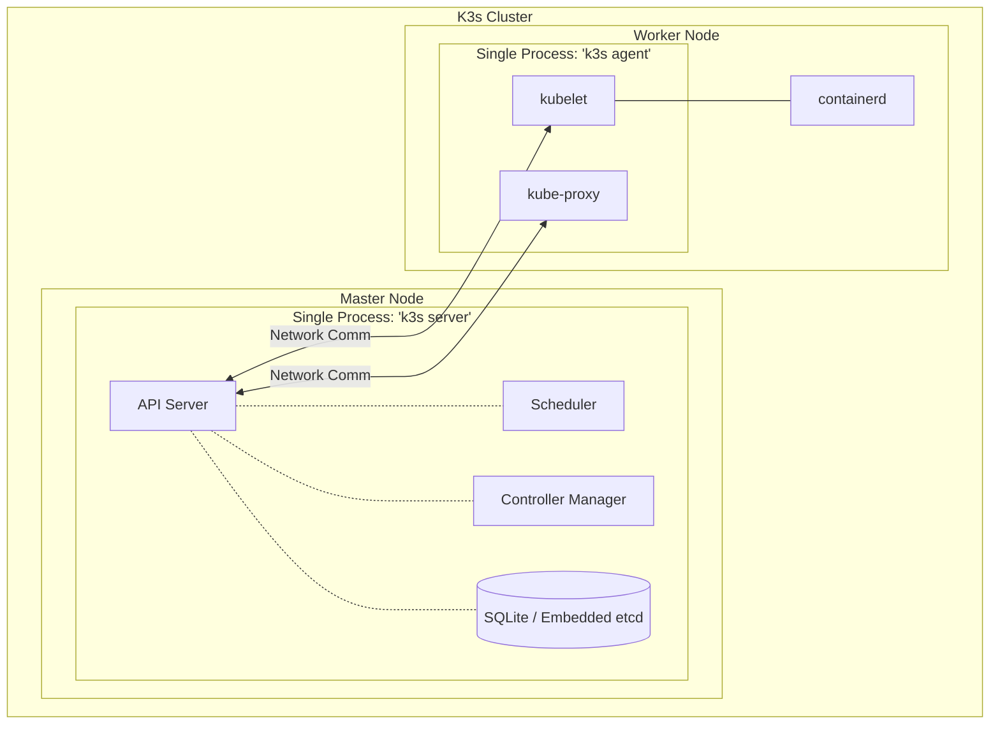

# Kubernetes (K8s) vs. Lightweight Kubernetes (K3s)

The short answer: **K3s is just Kubernetes, but stripped of all the bloated, unnecessary code and packaged into a single lightweight file.**

## The Key Differences

| Feature | K8s (Standard Kubernetes) | K3s (Lightweight Kubernetes) |
| :--- | :--- | :--- |
| **Size & Memory** | Very heavy. A standard master node usually requires at least 2GB-4GB of RAM just for the background services. | Extremely lightweight. It uses less than 500MB of RAM, making it perfect for small VMs, Raspberry Pis, or Edge devices. |
| **Architecture** | Complex. You have to install and manage many separate background components (api-server, scheduler, kube-proxy, etc.). | Simple. Everything is compiled into a **single, 70MB binary file**. You just run it, and everything starts instantly. |
| **Database** | Requires an external, heavy `etcd` database cluster to function. | Uses a simple `SQLite` file by default (but it can also use an embedded `etcd` for High Availability). |
| **Removed Bloat** | Includes tons of legacy cloud-provider code (like old AWS and Google Cloud volume drivers) built right into the code. | Rancher (the creators of K3s) deleted millions of lines of legacy code and out-of-tree plugins to make it fast. |
| **Included Extras** | Comes bare-bones. You have to install your own Load Balancer, Ingress Controller, and Storage classes manually. | Comes "Batteries Included". It automatically installs Traefik (for Ingress), a local storage provider, and a Service Load Balancer right out of the box. |

## Core Components Overview

Whether you are using standard K8s or K3s, the fundamental architecture is split into two main parts: the **Control Plane** (Master Nodes) and the **Data Plane** (Worker Nodes). 

### The Control Plane (Master Node Components)
* **kube-apiserver**: This is the brain and front-end of the cluster. All components talk to the API server.
* **etcd / SQLite**: The database. It stores the absolute state and configuration of your entire cluster.
* **kube-scheduler**: Watches for newly created Pods and selects a Worker Node for them to run on based on CPU/Memory availability.
* **kube-controller-manager**: Watches the state of the cluster and makes changes to push the current state towards the desired state.

### The Data Plane (Worker Node Components)
* **kubelet**: A tiny agent that lives on every node and talks to the API server. It ensures that the containers described to it are actually running and healthy.
* **kube-proxy**: Maintains network rules that allow network communication to your Pods from inside or outside of your cluster.
* **Container Runtime**: The actual software responsible for running containers (like `containerd`).

---

## Architecture Comparison

### Standard Kubernetes (K8s) Architecture

In standard K8s, every single component is highly decoupled. They run as entirely separate, independent background processes (or containers) that must communicate with each other over the network. 

```mermaid
graph TB
    subgraph "Standard K8s Cluster"
        subgraph "Master Node"
            direction TB
            API[kube-apiserver<br/>(Process 1)]
            SCHED[kube-scheduler<br/>(Process 2)]
            CTRL[kube-controller-manager<br/>(Process 3)]
            ETCD[(etcd Database<br/>(Process 4))]
            
            API --- SCHED
            API --- CTRL
            API --- ETCD
        end

        subgraph "Worker Node"
            direction TB
            KLET[kubelet<br/>(Process 5)]
            KPROX[kube-proxy<br/>(Process 6)]
            RUNTIME[containerd / Docker<br/>(Process 7)]
            
            KLET --- RUNTIME
        end
        
        API <-->|Network Comm| KLET
        API <-->|Network Comm| KPROX
    end
```

**Why it’s built this way:**
Standard K8s is designed for massive scale. Because everything is a separate process, you can scale them independently.

---

### Lightweight Kubernetes (K3s) Architecture

In K3s, Rancher took all of those separate, memory-heavy processes and smashed them together into a single compiled binary file.



**Why it’s built this way:**
Because all the control plane components share the exact same memory space inside the `k3s server` process, they don't have to constantly serialize and send data to each other over a network stack. This drastically reduces CPU overhead and cuts memory usage down to a fraction of standard K8s.
